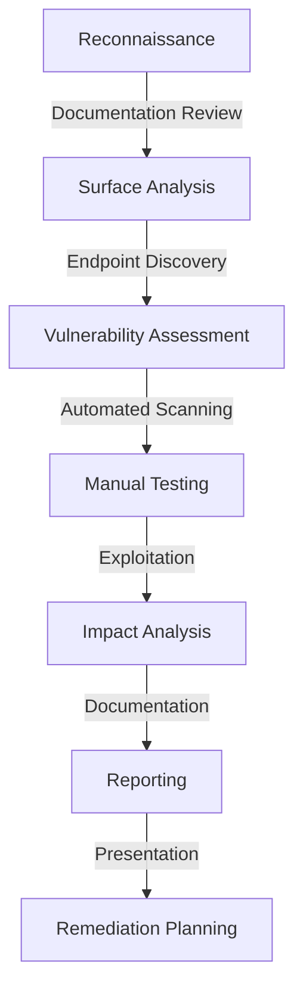
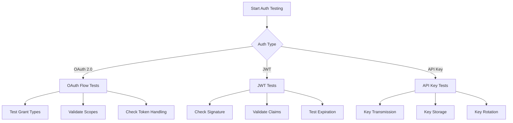
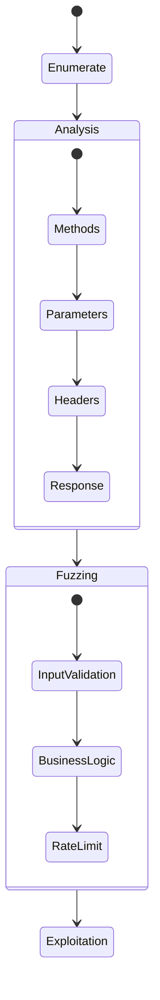
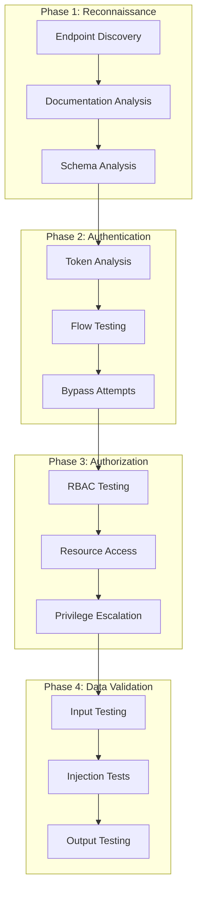
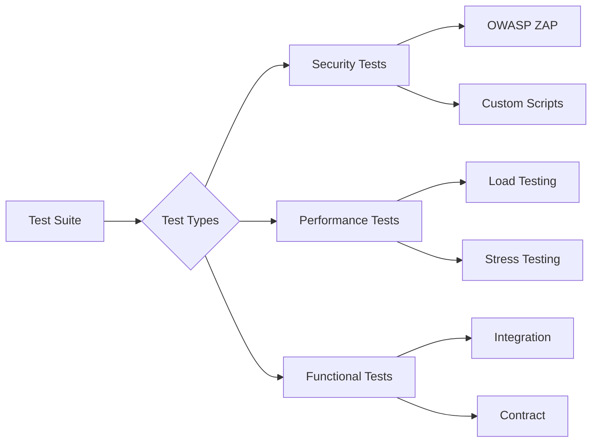
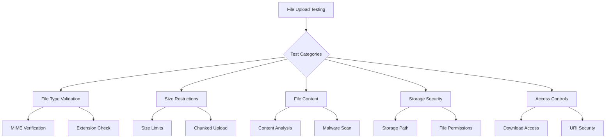
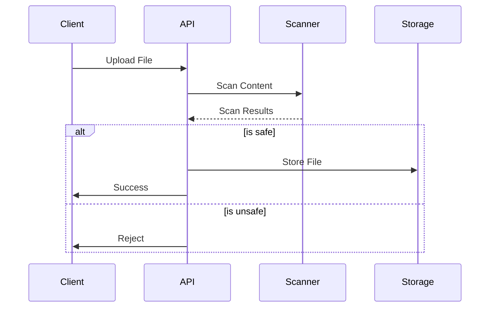
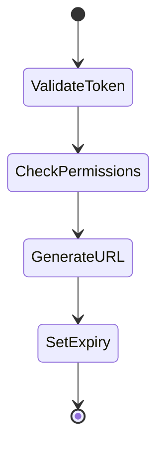
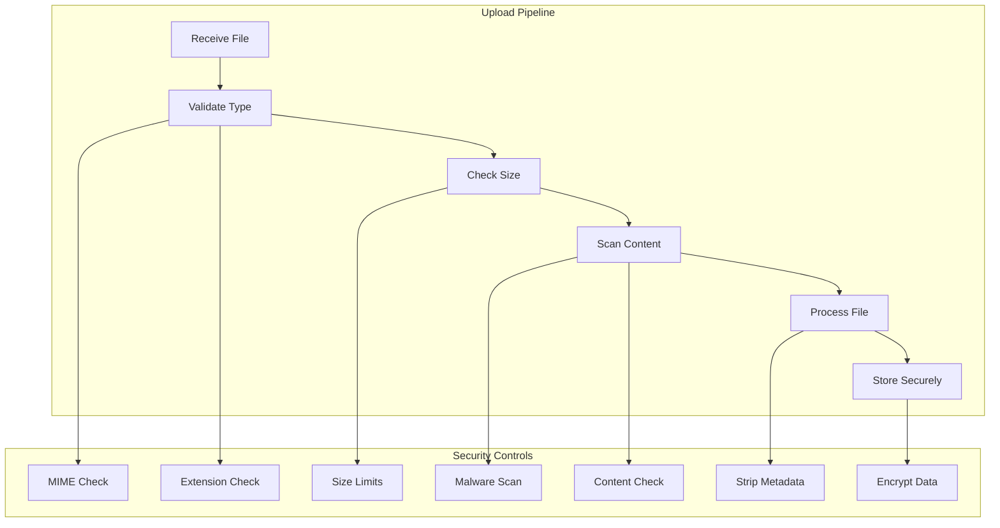
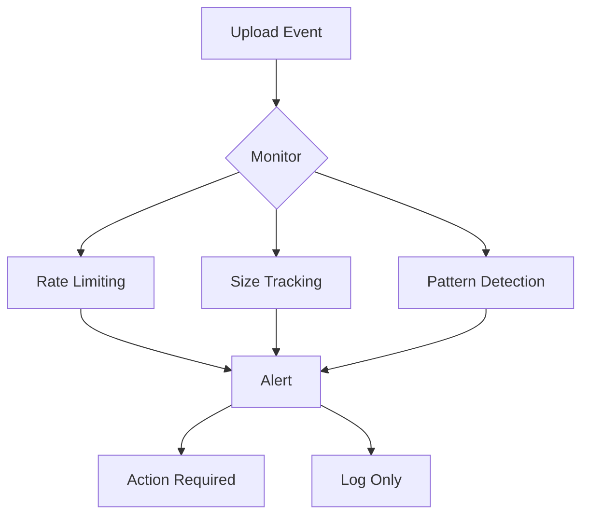

# API Security Assessment & Penetration Testing Framework
**Purpose:** To provide a systematic approach for conducting thorough API security assessments and penetration testing, ensuring comprehensive coverage of potential vulnerabilities and risks.

## Table of Contents
1. [Pre-Assessment Phase](#pre-assessment-phase)
2. [Technical Assessment Framework](#technical-assessment-framework)
3. [Risk Assessment Matrix](#risk-assessment-matrix)
4. [Testing Methodology](#testing-methodology)
5. [Reporting Templates](#reporting-templates)
6. [Executive Summary Template](#executive-summary-template)

## Pre-Assessment Phase

### Initial Documentation Requirements
- API Documentation
- Architecture Diagrams
- Data Flow Diagrams
- Authentication Mechanisms
- Previous Security Assessment Reports (if any)
- Business Impact Analysis
- Regulatory Requirements (GDPR, PCI-DSS, etc.)

### Preliminary Questionnaire for Stakeholders

#### Business Context
1. What is the primary business function of the API?
2. Who are the main consumers of the API?
3. What type of data does the API handle?
   - [ ] PII (Personally Identifiable Information)
   - [ ] Financial Data
   - [ ] Healthcare Information
   - [ ] Intellectual Property
   - [ ] Other Sensitive Data

#### Technical Overview
1. API Architecture Type:
   - [ ] REST
   - [ ] SOAP
   - [ ] GraphQL
   - [ ] gRPC
   - [ ] WebSocket

2. Authentication Methods:
   - [ ] OAuth 2.0
   - [ ] JWT
   - [ ] API Keys
   - [ ] Basic Auth
   - [ ] Custom

3. Environment Information:
   - Production URL:
   - Staging URL:
   - Development URL:
   - Load Balancer Details:
   - WAF Configuration:

## Technical Assessment Framework

### 1. Information Gathering
- [ ] API Documentation Review
- [ ] Endpoint Enumeration
- [ ] Parameter Analysis
- [ ] Response Pattern Analysis
- [ ] Error Message Analysis

### 2. Configuration Assessment
- [ ] TLS Configuration
- [ ] HTTP Headers
- [ ] CORS Policy
- [ ] Rate Limiting
- [ ] API Versioning

### 3. Authentication Testing
- [ ] Token Generation Process
- [ ] Token Validation
- [ ] Session Management
- [ ] Password Policies
- [ ] MFA Implementation

### 4. Authorization Testing
- [ ] Role-Based Access Control
- [ ] Resource-Level Permissions
- [ ] Horizontal Privilege Escalation
- [ ] Vertical Privilege Escalation
- [ ] Token Scope Validation

### 5. Data Validation
- [ ] Input Validation
- [ ] Output Encoding
- [ ] Content-Type Validation
- [ ] File Upload Handling
- [ ] JSON/XML Parsing

### 6. Business Logic Testing
- [ ] Workflow Bypass
- [ ] Resource Limits
- [ ] Race Conditions
- [ ] Time-Based Logic
- [ ] Data Integrity Checks

## Risk Assessment Matrix

| Severity | Impact | Likelihood | Description                                       |
| -------- | ------ | ---------- | ------------------------------------------------- |
| Critical | High   | High       | Immediate business impact, data breach risk       |
| High     | High   | Medium     | Significant security gap, potential data exposure |
| Medium   | Medium | Medium     | Security weakness requiring attention             |
| Low      | Low    | Low        | Minor security improvement recommended            |

## Testing Methodology



## Reporting Format

### Executive Summary
- Assessment Overview
- Key Findings
- Risk Ratings
- Remediation Roadmap

### Technical Findings Template
For each vulnerability:
```
Title: [Vulnerability Name]
Severity: [Critical/High/Medium/Low]
Affected Endpoint: [URL/Endpoint]
Description: [Technical description]
Impact: [Business impact]
Steps to Reproduce:
1. [Step 1]
2. [Step 2]
...
Recommendation: [Detailed fix]
References: [OWASP/CVE/etc.]
```

### Remediation Checklist
- [ ] Immediate Actions (0-30 days)
- [ ] Short-term Fixes (30-90 days)
- [ ] Long-term Improvements (90+ days)
- [ ] Architectural Changes
- [ ] Policy Updates

## CISO Presentation Template

### 1. Executive Overview
- Assessment Scope
- Methodology
- Key Findings Summary
- Risk Overview

### 2. Critical Findings
- Impact on Business
- Technical Risk
- Compliance Impact
- Data Security Impact

### 3. Remediation Strategy
- Quick Wins
- Strategic Improvements
- Resource Requirements
- Timeline

### 4. Metrics and KPIs
- Vulnerability Statistics
- Risk Reduction Timeline
- Security Posture Improvement
- Compliance Status

## Appendices

### A. Testing Tools Checklist
- [ ] Burp Suite Professional
- [ ] Postman
- [ ] OWASP ZAP
- [ ] Custom Scripts
- [ ] API Fuzzing Tools

### B. Compliance Mapping
- Map findings to:
  - OWASP API Security Top 10
  - NIST Guidelines
  - Industry-specific regulations

### C. Evidence Collection Guidelines
- Screenshot requirements
- HTTP Request/Response logging
- Proof of Concept code
- Impact demonstration

### D. Post-Assessment Activities
- [ ] Findings Review Meeting
- [ ] Technical Deep Dive Sessions
- [ ] Remediation Planning Workshop
- [ ] Follow-up Assessment Scheduling

---
## Detailed Technical Testing Procedures

### 1. Authentication Testing Procedures



#### OAuth 2.0 Test Cases
1. Authorization Code Flow
   http
   ```GET /oauth/authorize?
       response_type=code&
       client_id=CLIENT_ID&
       redirect_uri=CALLBACK_URL&
       scope=read+write&
       state=RANDOM_STATE
   ```
   - [ ] Validate redirect_uri
   - [ ] Check state parameter
   - [ ] Test PKCE implementation

2. Token Exchange
   http
   ```POST /oauth/token
   Content-Type: application/x-www-form-urlencoded
   
   grant_type=authorization_code&
   code=AUTH_CODE&
   redirect_uri=CALLBACK_URL&
   client_id=CLIENT_ID&
   client_secret=CLIENT_SECRET
   ```
   - [ ] Verify token lifetime
   - [ ] Check refresh token rotation
   - [ ] Test scope enforcement

#### JWT Testing Matrix
| Test Case | Procedure | Expected Result |
|-----------|-----------|-----------------|
| Algorithm None | Set alg: "none" | Reject token |
| Key Confusion | Switch RS256 to HS256 | Reject token |
| Invalid Signature | Modify payload | Validation fail |
| Expired Token | Adjust exp claim | Token rejected |

### 2. REST API Endpoint Testing



#### HTTP Method Testing Matrix
| Method | Test Cases                          | Security Checks           |
| ------ | ----------------------------------- | ------------------------- |
| GET    | Path traversal, parameter pollution | No sensitive data in URL  |
| POST   | JSON injection, XML entities        | Content-Type validation   |
| PUT    | Overwrite protection, size limits   | Resource locking          |
| DELETE | Race conditions, TOCTOU             | Soft delete verification  |
| PATCH  | JSON patch injection                | Partial update validation |

#### Parameter Testing Checklist
- [ ] Query Parameters
  http
```
GET /api/users?id=1 OR 1=1
GET /api/users?id=1;DROP TABLE users
GET /api/users?id[]=1&id[]=2
  ```

- [ ] Request Headers
 http
 ```
X-Forwarded-For: 127.0.0.1
X-Original-URL: /admin
Content-Type: application/json;charset=utf-7
  ```

- [ ] Request Body
  ```json
  {
    "id": {"$ne": null},
    "__proto__": {"admin": true},
    "constructor": {"prototype": {"isAdmin": true}}
  }
  ```

### 3. REST API-Specific Questionnaire

#### API Design & Architecture
1. Resource Naming Convention
   - [ ] How are API endpoints named?
   - [ ] Is versioning included in the URL path?
   - [ ] Are nested resources properly represented?

2. Response Status Codes
   - [ ] Which HTTP status codes are used?
   - [ ] How are errors handled?
   - [ ] Are custom status codes used?

3. Data Format
   - [ ] JSON Schema validation?
   - [ ] Content negotiation support?
   - [ ] Handling of date/time formats?

4. Pagination Implementation
   - [ ] What pagination method is used?
   - [ ] Are limits enforced?
   - [ ] How is cursor-based pagination handled?

#### Security Controls
1. Rate Limiting
   http
   ```
   X-RateLimit-Limit: 100
   X-RateLimit-Remaining: 99
   X-RateLimit-Reset: 1618884480
   ```
   - [ ] Per endpoint limits?
   - [ ] User/IP based limits?
   - [ ] Burst handling?

2. Request/Response Headers
   http
   ```
   Content-Security-Policy: default-src 'self'
   X-Content-Type-Options: nosniff
   X-Frame-Options: DENY
   ```
   - [ ] Security headers implemented?
   - [ ] CORS policy configuration?
   - [ ] Cache control headers?

### 4. Visual Testing Flow



### 5. Security Control Testing Matrix

| Category | Control | Test Case | Tool/Method |
|----------|---------|-----------|-------------|
| Input Validation | Schema Validation | Invalid data types | Custom fuzzer |
| Authentication | Token Security | Token replay | Burp Suite |
| Authorization | RBAC | Horizontal access | Custom scripts |
| Rate Limiting | Request Throttling | Burst requests | Apache Bench |
| Data Protection | Encryption | Man-in-middle | Wireshark |

### 6. Automated Testing Setup



### 7. Response Analysis Framework

#### Status Code Coverage Matrix
| Code Range | Expected Cases | Test Cases |
|------------|----------------|------------|
| 2XX | Success responses | Valid requests |
| 3XX | Redirections | URL changes |
| 4XX | Client errors | Invalid auth |
| 5XX | Server errors | Edge cases |

#### Response Header Analysis
```http
HTTP/1.1 200 OK
Cache-Control: no-store
Content-Type: application/json
X-Content-Type-Options: nosniff
```
- [ ] Security headers present
- [ ] Caching headers appropriate
- [ ] Content-Type verification


---
# API File Upload Security Testing & Best Practices Framework

## 1. File Upload Testing Cases



### 1.1 File Type Validation Tests

#### MIME Type Tests
```http
POST /api/upload HTTP/1.1
Content-Type: multipart/form-data; boundary=----WebKitFormBoundary7MA4YWxkTrZu0gW

------WebKitFormBoundary7MA4YWxkTrZu0gW
Content-Disposition: form-data; name="file"; filename="malicious.jpg"
Content-Type: image/jpeg

[PHP SHELL CONTENT]
------WebKitFormBoundary7MA4YWxkTrZu0gW--
```

| Test Case | Description | Expected Result |
|-----------|-------------|-----------------|
| MIME Spoofing | Change Content-Type header | Reject incorrect MIME |
| Double Extension | file.php.jpg | Reject suspicious files |
| Null Byte | file.php%00.jpg | Handle null bytes properly |
| Case Sensitivity | File.PHP.jpg | Normalize extensions |
| Empty Extension | file. | Reject invalid names |

#### Content Verification Matrix
| File Type | Validation Method | Test Cases |
|-----------|------------------|------------|
| Images | Magic Numbers | Check first bytes |
| PDFs | PDF Header | Verify PDF structure |
| Archives | Archive Structure | Check file signatures |
| Documents | Office Markers | Validate document structure |

### 1.2 Size Restriction Tests

#### Chunked Upload Tests
```http
POST /api/upload HTTP/1.1
Content-Range: bytes 0-1048575/3146789
Content-Type: application/octet-stream

[CHUNK_DATA]
```

Test Cases:
1. Maximum File Size
```python
def test_max_file_size():
    tests = [
        {"size": "1MB", "expected": "accept"},
        {"size": "MAX_LIMIT + 1", "expected": "reject"},
        {"size": "0B", "expected": "reject"},
        {"size": "MAX_CHUNK_SIZE + 1", "expected": "reject"}
    ]
```

2. Chunked Upload Scenarios
- [ ] Overlapping chunks
- [ ] Missing chunks
- [ ] Out-of-order chunks
- [ ] Duplicate chunks
- [ ] Zero-sized chunks

### 1.3 File Content Security Tests

#### Content Analysis Matrix
| Content Type | Security Checks | Test Cases |
|--------------|----------------|------------|
| Executables | Code signatures | Embedded scripts |
| Images | Metadata stripping | EXIF exploitation |
| Documents | Macro detection | Embedded objects |
| Archives | Recursive analysis | Zip bombs |

#### Malware Scanning Pipeline


### 1.4 Storage Security Tests

#### Path Traversal Test Cases
```http
POST /api/upload HTTP/1.1
Content-Disposition: form-data; name="file"; filename="../../etc/passwd"
```

| Test Case | Input | Expected Result |
|-----------|-------|-----------------|
| Directory Traversal | ../../../file | Reject |
| Symbolic Links | symlink.txt | Resolve & validate |
| Special Characters | file\x00.txt | Sanitize |
| Unicode Encoding | file＄.txt | Normalize |

### 1.5 Access Control Tests

#### Download URL Security


Test Cases:
1. URL Structure Security
```http
GET /api/files/download?file=sensitive.pdf&token=xyz
GET /api/files/download/[encrypted_file_id]
GET /api/files/[user_id]/[file_id]/download
```

2. Token Validation
- [ ] Expiration checks
- [ ] Scope validation
- [ ] User context verification
- [ ] Rate limiting

## 2. Security Best Practices

### 2.1 File Upload Implementation



### 2.2 Implementation Checklist

#### Pre-Upload Checks
- [ ] Client-side validation
  ```javascript
  const validateFile = (file) => {
    const validTypes = ['image/jpeg', 'image/png', 'application/pdf'];
    const maxSize = 5 * 1024 * 1024; // 5MB
    
    if (!validTypes.includes(file.type)) {
      throw new Error('Invalid file type');
    }
    
    if (file.size > maxSize) {
      throw new Error('File too large');
    }
  };
  ```

#### Server-side Validation
```python
def validate_upload(file):
    # File type validation
    allowed_types = {'image/jpeg', 'image/png', 'application/pdf'}
    if file.content_type not in allowed_types:
        raise ValidationError('Invalid file type')
    
    # Size validation
    if file.size > settings.MAX_UPLOAD_SIZE:
        raise ValidationError('File too large')
    
    # Content validation
    content_type = magic.from_buffer(file.read(1024), mime=True)
    if content_type != file.content_type:
        raise ValidationError('File content mismatch')
    
    # Malware scan
    if not scan_file(file):
        raise SecurityError('File failed security scan')
```

### 2.3 Storage Best Practices

#### File Storage Security Matrix
| Aspect | Implementation | Verification |
|--------|---------------|--------------|
| Encryption | AES-256 | Check encrypted storage |
| Access Control | RBAC | Verify permissions |
| Monitoring | Audit logs | Check access patterns |
| Backup | Redundancy | Verify recovery |

### 2.4 Response Handling

#### Success Response
```http
HTTP/1.1 201 Created
Content-Type: application/json
{
    "file_id": "abc123",
    "name": "sanitized_filename.pdf",
    "size": 1048576,
    "type": "application/pdf",
    "upload_date": "2024-03-18T10:30:00Z",
    "expiry": "2024-03-19T10:30:00Z"
}
```

#### Error Response
```http
HTTP/1.1 400 Bad Request
Content-Type: application/json
{
    "error": "FILE_VALIDATION_FAILED",
    "message": "File type not allowed",
    "details": {
        "allowed_types": ["image/jpeg", "image/png", "application/pdf"],
        "received_type": "application/javascript"
    }
}
```

### 2.5 Security Headers

```http
Content-Security-Policy: default-src 'self'
X-Content-Type-Options: nosniff
X-Frame-Options: DENY
Content-Disposition: attachment; filename="safe_filename.pdf"
Cache-Control: no-store
```

### 2.6 Monitoring and Alerts

#### Monitoring Matrix
| Event | Trigger | Action |
|-------|---------|--------|
| Multiple failures | >5 in 1min | Alert admin |
| Large files | >100MB | Review queue |
| Malware detected | Any occurrence | Block IP |
| Pattern abuse | Repeated attempts | Rate limit |


